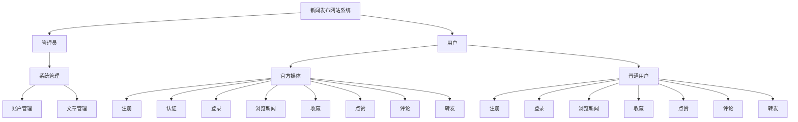
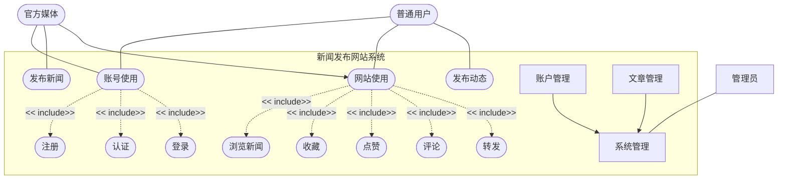
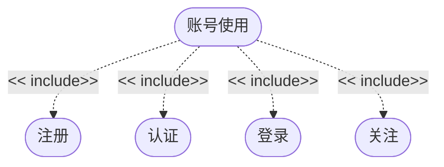
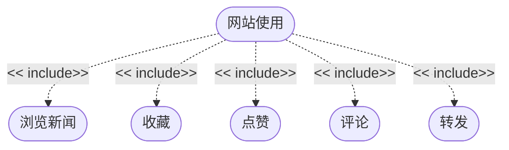
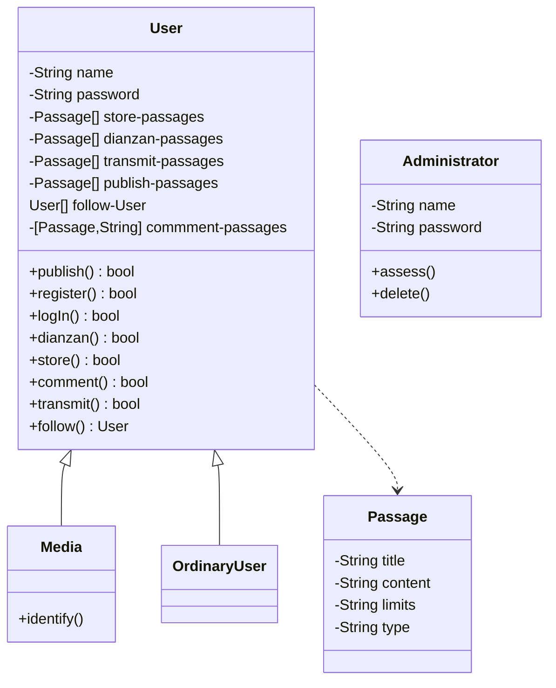
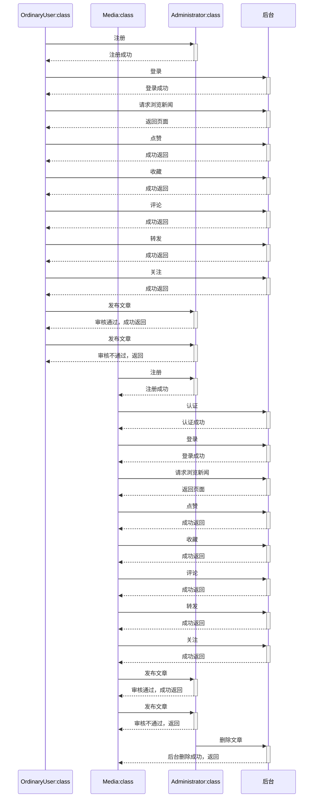

# 一、软件计划文档

## 1、系统概述

## 2、软件开发过程模型。例如是瀑布型、原型、敏捷等。	

| 软件生命周期 | 是否首先定义好所有的需求 | 是否有多个开发周期 | 是否有中间软件 |
| ------------ | ------------------------ | ------------------ | -------------- |
| 瀑布型       | 是                       | 没有               | 没有           |

## 3、项目估算 
### a)规模估算
模块复杂度估算：各种类别模块的个数。例如：简单模块（例如业务逻辑简单，数据库表的访问不超过3个表，较少的数据展示等）、中等模块（业务逻辑复杂度一般，表的访问个数不超过4个，数据展示量中等）、复杂模块（业务逻辑较复杂，表的访问个数超过4个，较多的数据展示）。预估的代码行数（KLOC）

### b)进度估算

| 阶段       | 开始日期 | 结束日期 | 工作日 |
| ---------- | -------- | -------- | ------ |
| 软件计划   | 20220314 | 20220316 | 1      |
| 需求调研   | 20220314 | 20220316 | 1      |
| 需求分析   | 20220314 | 20220316 | 1      |
| 概要设计   | 20220324 | 20220325 | 2      |
| 详细设计   | 20220330 | 20220401 | 3      |
| 编码       | 20220414 | 20220526 | 13     |
| 测试       | 20220527 | 20220531 | 5      |
| 部署及验收 | 20220601 | 20220601 | 1      |
| 总计       | 20220314 | 20220601 | 27     |

### c)工作量估算

| 阶段       | 阶段工作力占总工作里的百分比 | 工作量（人，天） |
| ---------- | ---------------------------- | ---------------- |
| 软件计划   | 3.7%                         | (5,1)            |
| 需求调研   | 3.7%                         | (5,1)            |
| 需求分析   | 3.7%                         | (5,1)            |
| 概要设计   | 7.4%                         | (5,2)            |
| 详细设计   | 11.1%                        | (5,3)            |
| 编码       | 48.1%                        | (5,13)           |
| 测试       | 18.5%                        | (2,5)            |
| 部署及验收 | 3.7%                         | (5,1)            |
| 总计       | 100%                         | (5,27)           |

### d)成本估算
按照例如自下而上估算发、自上而下估算法、用例点估算法、代码行估算法、功能点估算法等进行软件系统的成本估算。

## 4.人力资源安排
按照项目开发阶段或者模块进行人力资源的分配。

### (1) 参与人员基本信息

| 角色  |  职责 | 人员  |
|---|---|---|
| 组长  | 项目团队管理、进度检查把控  | 吴嘉露  |
| 前端开发者 | 实现Web页面结构、Web的外观视觉展现、Web层面的交互  | 刘雨佳、周济  |
| 后端开发者  | 项目功能实现、实现数据库数据存取、保证平台稳定性及性能   | 吴嘉露、苑照月、谭伯南   |
| 测试用户  | 角色扮演用户对软件进行测试  |   |
| 系统测试员  | 对软件进行测试 编写软件测试文档   |   |

### (2) 主要阶段及参与者

| **阶段**   | **成员**   |
|---|---|
|软件计划   |  全员 |
|需求调研   | 全员  |
|需求分析   | 周济  |
|概要设计   | 吴嘉露、刘雨佳  |
|详细设计   | 吴嘉露、苑照月、谭伯南  |
|前端编码   | 刘雨佳、周济  |
|后端编码   | 吴嘉露、苑照月、谭伯南 |
|测试      |  苑照月、谭伯南、刘雨佳、周济 |
|部署及验收 | 吴嘉露  |

## 5.开发工具与环境：
  本项目给予浏览器的方式进行访问，此阿勇springboot集成快速开发框架，前端使用vue方式，开发工具为IDEA开发工具。
|软件环境|版本|备注|
|---|---|---|
|windows操作系统|10||
|数据库MYSQL|8.0||
|编程开发工具软件IDEA|2020.2||
|node.js|11.3.0||

## 6.测试环境：

### (1)硬件环境

| **设备名称** |成员个人计算机|
|---|---|
| **用途** | 软件测试|
| **备注** | |

### (2)软件环境
|**软件名称**| **版本号** | **备注** |
|---|---|---|
|chrome浏览器 | 61.0.3163.79| |
|Zed Attack Proxy|2.11.1| | 

## 7. 风险估计和控制 

| 风险项     | 描述  | 风险降低策略  |
|:------------:|:-------------|:------------|
| 
恶意代码注入
 | 如果从网页输入的数据可能作为代码或SQL查询的一部分在后台被执行，那么一些用户即得以将恶意代码注入后台，以使程序出现错误。如果意外地运行在拥有较高权限的操作系统用户上，恶意代码还可能泄露后台数据，破坏文件系统。 | 加强用户输入数据的格式检查，避免将未经处理的数据整合到可执行的环境中去。 |
| 编辑内容丢失 | 由于网络不稳定、意外操作、浏览器崩溃等因素，前端编辑页面没有向后端成功发送完整内容数据，而编辑页面已经关闭，导致所编辑的内容丢失。若编辑人没有其他备份，那么只能从头再来。 | 在编辑时进行浏览器端自动保存，等待后端的确认信息到达前端，方将备份删除。如出现意外状况，下次打开时检查到自动保存的数据，则加载之。 |
| 内容可见性规定失效 | 一般而言，未经审核的内容在审核人确定合法之前都是不可显示在网页上的，如果系统的可见性设置失效，一些不符合国家相关法律法规的言论及媒体内容将暴露在互联网上，容易株连系统管理员一起进局子蹲大牢。 | 不首先在内容数据库中，而是通过另外的形式保存未经审核的内容。在审核通过之后，才在内容数据库中建立其记录，并标记为可见。此外还必须保证处理可见性代码的可用性。 |
| 用户权限规定失效 | 错误地判断了用户的权限等级或让实际访问人得到了其他用户的权限，将可能导致发生严重后果。 | 对于用户的每次操作，都保证必须经过身份验证，且在访问用户表的代码中杜绝透露任何其他表中用户的可能。 |
| 干扰其他关键进程运行 | 如果系统存在错误导致占用大量服务器资源而不能自检退出，尤其是当操作系统软件本身不稳定时，可能会干扰服务器上其他关键进程运行。 | 测试环节加大力度。 |

## 8. 测试计划

| 测试项 | 内容 |负责人| 时间 |
|:-----:|:----|:----|:----:|
| 
单元测试
 | 使用自动化单元测试框架，对所有基本的程序构件进行白盒测试。 | XXX，XXX | 
5月13日 - 5月15日
 |
| 集成测试 | 把两个已经测试过的单元组合成一个组件，测试它们之间的接口。同时还要测试一些主要业务功能。 | XXX，XXX |5月18日 - 5月19日 |
| 系统测试 | 采用黑盒方式来测试是否符合需求规格。在经过以上各阶段测试确认之后，把系统完整地模拟客户环境，即将已经确认的软件、计算机硬件、外设、网络等其他元素结合在一起，进行信息系统的各种组装测试和确认测试。尽可能彻底地检查出程序中的错误，提高软件系统的可靠性。 | XXX，XXX | 5月21日 - 5月22日 |
| 验收测试 | 由最终用户进行测试反馈。 | XXX | 5月23日 - 5月25日 |

## 9. 评审计划

| 计划项 | 对象 | 负责人 | 时间 |
|:-----:|:---:|:------|:----:|
| 代码走查 | 代码 | 各开发人员 | 开发阶段结束前 |
| 代码审查 | 代码 | 架构师 | 开发阶段结束前 |
| 文档评审 | 注释、文档 | 架构师 | 开发阶段以及测试阶段 |

## 10. 质量保证计划

| 计划项 | 内容 | 形式   | 负责人| 时间 |
|:-----:|:----|:-----:|:-----|:----:|
| 
软件需求评审
 | 检查软件需求说明书是否覆盖了用户的所有要求。 | 
会议
 | XXX，XXX | 
4月10日
 |
| 概要设计评审 | 要设计说明书是否正确、完整、与软件需求说明书的要求一致，系统的模块划分是否合理，接口定义是否明确，文档是否符合有关标准规定。 | 会议 | XXX | 4月15日 |
| 代码走查 | 开发人员和架构师交换有关代码是如何书写的思路，并建立一个对代码的标准集体阐述。检查注释内容和格式、代码规范，对照错误列表检查程序，对程序推演测试数据。 | 报告 | XXX | 阶段结束前不定期组织 |
| 代码审查 | 由多位参与者分阶段进行。一行一行的审查代码，彻底的找到程序中的缺陷。 | 会议 | XXX | 4月18日 - 5月10日 组织多次 |
| 测试阶段评审 | 对各测试用例进行详细的定义和说明，审核测试用例、环境、测试软件、测试工具等准备工作是否全面、到位。 | 报告 | XXX | 5月11日 - 5月20日 |
| 验收鉴定 | 开发的软件系统是否已达到软件需求说明书规定的各项技术指标，手册是否完整、正确，文档是否齐全，是否符合有关标准。 | 会议 | XXX | 5月22日 - 5月23日 |

# 二、需求分析

## 1、系统概述

​		新闻浏览交流平台是新闻媒体工作者发布新闻公告、传达社会心声，群众用户了解社会、参与时事交流的重要平台。其对应的用户主要有三类：管理员、媒体工作者、普通用户。

​		其中管理员可以对注册的普通用户账号和媒体用户账号进行管理，当用户进行账号注册时，管理员负责对用户身份进行核查，主要是对媒体用户账号进行甄别和确认；当用户发表不恰当言论时，管理员有权利对该账号进行封禁，即删除该账号及该账号有关信息。

​		媒体用户注册登陆账号后可以浏览新闻、搜索新闻或对新闻进行评论，同时媒体用户可以借助该账号进行媒体平台的运营，主要包括发布新闻、修改新闻稿及删除某个已发布的新闻。

​		普通用户注册登录账号后可以浏览新闻、搜索新闻或对新闻进行评论。

​		同时本系统首页除显示最新发布的新闻外，还有根据新闻热度排序的热搜榜，用户均可以查看热搜榜进而浏览感兴趣的新闻。

​		本系统可以方便社会新闻的发布、传播和管理。根据社会身份的不同，系统设置了三种不同类型账号，便于对不同用户可使用的功能进行管理；便于普通用户了解新闻，媒体工作者传播新闻。

## 2、需求概述

### 目标

新闻内容的管理：包括新闻稿的录入、修改和删除

媒体用户信息的管理：包括媒体用户信息注册、修改和删除

普通用户信息的管理：包括普通用户信息注册、修改和删除

评论内容的管理：包括评论的提交和删除

### 运行环境

MySQL、Browser、Springboot、tomcat

### 用户的特点

内容生产者（媒体用户）：借助本平台发布新闻或公告等，用户群体相对较小，大多为新闻从业者，专业水平较强。

内容消费者（普通用户）：借助本平台浏览新闻，了解信息，用户群体相对较大，职业不限，评论为多家之言。

平台管理者（管理员）：本平台秩序的维护者，本系统后台工作者，人数较少。

### 关键点

​		实现新闻的发布、显示和删除，即媒体用户发布新闻，普通用户浏览新闻。

## 3、运行环境

### 软件环境

开发平台：idea

操作系统：Windows

数据库：MySQL

客户端平台：不限

### 硬件环境

应用服务器：tomcat测试

数据库服务器：MySQL

## 4.需求规定
### （1）软件系统总体功能结构
 新闻发布网站系统分为管理员管理模块和用户模块。管理员通过操纵后端数据库对用户发布文章的内容进行管理。用户分认证为官方媒体的用户和普通用户两类。官方媒体可以发布官方新闻，普通用户可以发布动态。所有用户都可以对新闻进行点赞、收藏、评论、转发等操作。

### 系统功能结构图

### (2)功能需求
### 总用例图

### 子用例图

### 描述用例“账号使用”：
基本流：用户注册账户号，注册通过后进行登录、认证、关注等操作

可选流：只有官方媒体认证才可以通过

### 描述用例“网站使用”：

基本流：用户登录后可进行浏览新闻、收藏、点赞、评论和转发等操作。

可选流：文章权限为私密不能浏览。

可选流：文章没有获得权限不能随意转发。

### 敏捷开发的用户故事
注册账户，登录网站浏览新闻，并有转发、点赞、收藏、评论等操作。

### 场景描述
用户注册登录后即可浏览网页新闻，并可根据需要进行点赞、收藏、转发、评论等操作。

### 领域模型图（概念类图）

### 顺序图

### （3）非功能性需求
### 性能需求
该系统要保证管理员能有效地管理官方媒体的认证、所有用户文章发布的管理。所有用户可以实现注册登录的功能（官方媒体还包括认证的功能），登录后可在网页浏览新闻，可对新闻进行点赞、收藏、评论、转发等操作。

### 并发性需求
网站可实现多个用户同时登录。

### 安全性需求
用户的信息存储管理好，不外泄；系统健壮性程度高，不会出现运行差错。

