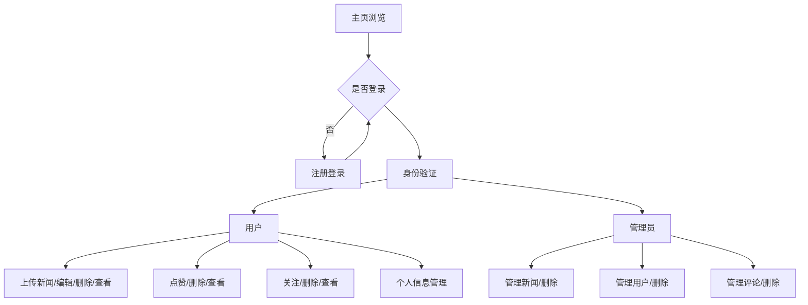
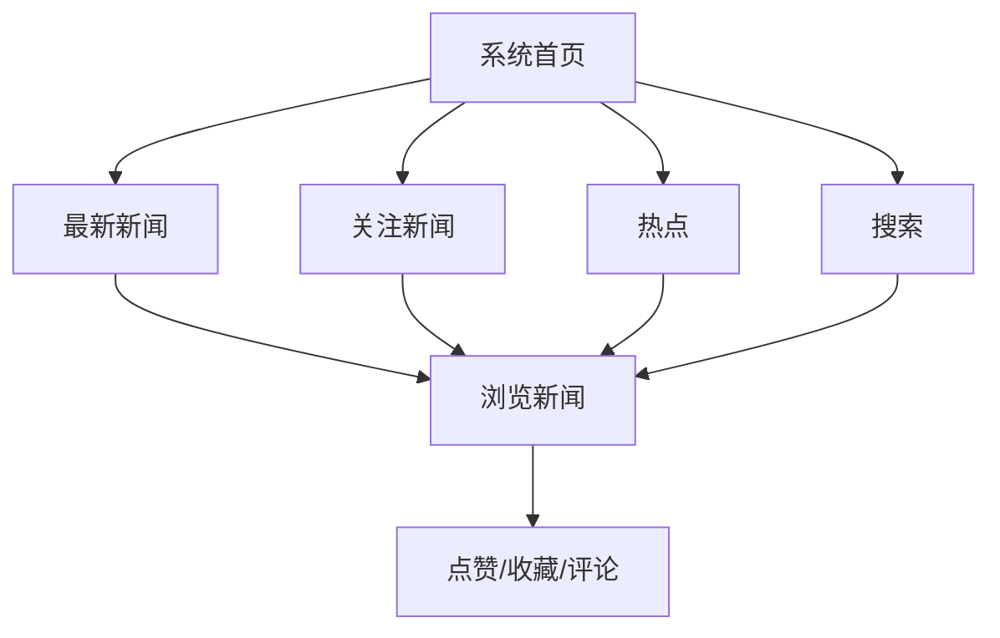
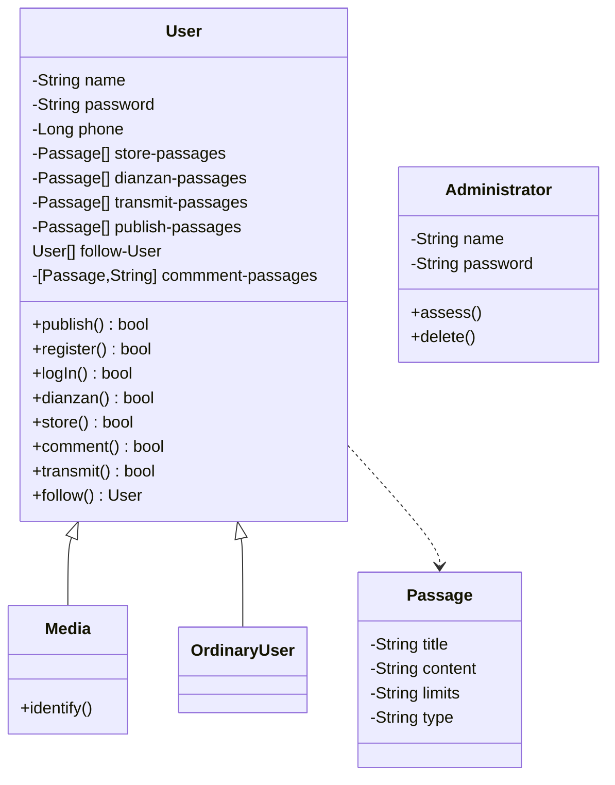

# 三、概要设计
## 1. 系统概述

本系统乃以作为新闻浏览交流平台之目的而设计，即为新闻媒体工作者发布新闻公告、传达社会心声，群众用户了解社会、参与时事交流的重要平台。

本项目欲于系统内实现的功能有网页前端、用户权限系统、新闻条目管理、评论功能、基于时效或热度推送等。传播学数据收集与分析、用户定向推送等功能考虑到其复杂性，在当前阶段暂时不考虑实现。

在欲建立的用户权限系统中，对应的用户主要有三类：管理员、媒体工作者、普通用户。​其中管理员可以对注册的普通用户账号和媒体用户账号进行管理，当用户进行账号注册时，管理员负责对用户身份进行核查，主要是对媒体用户账号进行甄别和确认；当用户发表不恰当言论时，管理员有权利对该账号进行封禁，即删除该账号及该账号有关信息。媒体用户注册登陆账号后可以浏览新闻、搜索新闻或对新闻进行评论，同时媒体用户可以借助该账号进行媒体平台的运营，主要包括发布新闻、修改新闻稿及删除某个已发布的新闻。​普通用户注册登录账号后可以浏览新闻、搜索新闻或对新闻进行评论。

​本系统首页除显示最新发布的新闻外，还有根据新闻热度排序的热搜榜，用户均可以查看热搜榜进而浏览感兴趣的新闻。

​本系统可以方便社会新闻的发布、传播和管理。根据社会身份的不同，系统设置了三种不同类型账号，便于对不同用户可使用的功能进行管理；便于普通用户了解新闻，媒体工作者传播新闻。

## 2. 开发与运行环境

### 软件环境
  - 开发环境 / 后端运行环境（典型）
    | | |
    | ------- | --------------------------- |
    | 操作系统 | Ubuntu 22.04 LTS (Linux 5.15) |
    | Web 服务器 | nginx 1.21.6 |
    | 数据库服务器 | MariaDB 10.6.7 (MySQL API) |
    | Java 执行环境 | Java SE Development Kit 18.0.1.1 |
    | JavaScipt 执行环境 | node.js 11.3.0|
    | 项目构建工具 | Maven 3.8.5 |
    | 应用框架 | Spring Boot 2.6.7 |
    | 数据持久化框架 | MyBatis 3.5.9 |
    | 
  - 前端运行环境（典型）
    | | |
    | ------- | --------------------------- |
    | 操作系统 | Ubuntu 22.04 LTS (Linux 5.15)   Windows 10 (Build 19043)   Windows 11 (Build 22610) |
    | 浏览器 | Chrome 101.0.4951.54   Firefox 101.0b3 |

### 硬件环境
  - 开发环境/ 运行环境（典型）
    | | |
    | ------- | --------------------------- |
    | CPU | Intel Core i5-7500 (AMD64) |
    | 内存 | 8 GB |
    | 硬盘 | 500 GB SSD |
    | 显卡 | NVIDIA GeForce GTX 1050 Ti |
    | 显示器 | 1920×1080 60Hz |

## 5.关键技术和算法

网站的初期，我们会在单机上跑我们所有的程序和软件。此时我们使用一个容器tomcat，然后直接使用开源的框架maven+spring+springmvc+mybatis；最后再选择一个数据库管理系统来存储数据，如mysql，然后通过JDBC进行数据库的连接和操作。

本项目便设计与实现了前端开发基于 vue框架，结合 HTML、CSS、 JavaScript等技术实现，后端开发基于 Spring + Boot 框架的个人博客系统，解决了传统博客的一些问题。本系统强调了Web前端组件化的思想，系统在服务器部分，使用了 Spring + Boot 的后端的开发框架。 IDEA 作为服务器开发环境，非常稳定和高效并能保证系统在服务器的业务逻辑处理中能够响应快速并易于扩展。数据库采用了用面向文档的关系型数据库 MYSQL ，由于其体积小、速度快、总体成本低，开放源码。

## 6.系统功能设计
### 1）功能性设计
该系统要保证管理员能有效地管理官方媒体的认证、所有用户文章发布的管理。所有用户可以实现注册登录的功能（官方媒体还包括认证的功能），登录后可在网页浏览新闻，可对新闻进行点赞、收藏、评论、转发等操作。
#### 功能1 用户和管理员登录使用网页

#### 功能2 网页浏览

类图：

### 2）非功能性设计
#### (1)性能需求
该系统要保证管理员能有效地管理官方媒体的认证、所有用户文章发布的管理。所有用户可以实现注册登录的功能（官方媒体还包括认证的功能），登录后可在网页浏览新闻，可对新闻进行点赞、收藏、评论、转发等操作。

#### (2)并发性需求
网站可实现多个用户同时登录。

#### (3)安全性需求
用户的信息存储管理好，不外泄；系统健壮性程度高，不会出现运行差错。

## 7.数据库设计

### 1) 采用的数据库

​		数据库管理系统：MySQL

​		版本：8.0.26

​		MySQL是一个关系型数据库管理系统，将数据保存在不同的表中，而不是将所有数据放在一个大仓库内，增加了速度并提高了灵活性。

​		MySQL所使用的 SQL 语言是用于访问数据库的最常用标准化语言。MySQL 软件采用了双授权政策，分为社区版和商业版，由于其体积小、速度快、总体拥有成本低，尤其是开放源码这一特点，可以大大降低总体拥有成本，一般中小型网站的开发都选择 MySQL 作为网站数据库。

### 2) 数据库表的设计

#### a.user表

| 字段名   | 类型    | 长度 | 不是null   | 键   |
| -------- | ------- | ---- | ---------- | ---- |
| user_id  | varchar | 255  | 不可为null | 主键 |
| password | varchar | 255  |            |      |
| phone    | bigint  |      |            |      |
| type     | varchar | 255  |            |      |

- user_id：用户在系统中的用户名称，user表的主键，唯一标识不同的用户，用户注册时由用户确定。新用户注册时，搜索数据库user表中的user_id字段，确保当前要注册的user_id尚未被注册过，才能进行注册；否则注册失败，提示用户修改用户名后重新注册。

- password：用户密码，由用户注册时设定，后续可进入用户中心修改。
- phone：用户联系方式，由用户注册时设定，后续可进入用户中心修改。
- type：用户类型，包括普通用户、媒体账号和管理员用户。三者在本系统中的身份和功能权限不同，媒体用户可发布官方新闻、公告等内容，有较大的公信力；普通用户可以发表普通言论，对新闻等内容进行评论；管理员负责管理本系统的用户、新闻内容、评论等，维护系统秩序，保证系统正常运行。

#### b.passage表

| 字段名     | 类型     | 长度 | 不是null | 键   |
| ---------- | -------- | ---- | -------- | ---- |
| passage_id | int      |      | 不是null | 主键 |
| title      | varchar  | 255  |          |      |
| keyword    | varchar  | 255  |          |      |
| user_id    | varchar  | 255  |          | 外键 |
| time       | datetime |      |          |      |
| content    | longtext |      |          |      |
| good_count | int      |      |          |      |

- passage_id：上传到系统中的新闻标号，passage表的主键，由系统自增产生，唯一标识一篇新闻。

- title：新闻的标题，由媒体用户上传新闻时取得，可供、用户筛选、浏览、搜索。

- keyword：新闻关键字，概括新闻大致内容，可供用户筛选、搜索。

- user_id：用户名，本篇新闻的上传者，user表主键，passage表的外键。

  | 外键名          | 字段    | 被引用的表 | 被引用的字段 | 删除时  | 更新时  |
  | --------------- | ------- | ---------- | ------------ | ------- | ------- |
  | passage_user_id | user_id | user       | user_id      | CASCADE | CASCADE |

- time：新闻上传的时间。

- content：新闻正文内容。

- good_count：点赞该新闻的用户数量。

#### c.comment表

| 字段名     | 类型     | 长度 | 不是null | 键   |
| ---------- | -------- | ---- | -------- | ---- |
| comment_id | int      |      | 不是null | 主键 |
| user_id    | varchar  | 255  | 不是null | 外键 |
| passage_id | int      |      | 不是null | 外键 |
| review     | text     |      |          |      |
| time       | datetime |      |          |      |

- comment_id：用户发布的评论的标号，comment表的主键，由系统自增产生，用于唯一标识一条评论。

- user_id：发布评论的用户名，user表的主键，comment表的外键。

- passage_id：评论所属的新闻，passage表的主键，comment表的外键。

  | 外键名             | 字段       | 被引用的表 | 被引用的字段 | 删除时  | 更新时  |
  | ------------------ | ---------- | ---------- | ------------ | ------- | ------- |
  | comment_passage_id | passage_id | passage    | passage_id   | CASCADE | CASCADE |
  | comment_user_id    | user_id    | user       | user_id      | CASCADE | CASCADE |

- review：评论的内容。
- time：用户发表评论的时间。

#### d.follow表

| 字段名           | 类型    | 长度 | 不是null | 键   |
| ---------------- | ------- | ---- | -------- | ---- |
| user_id          | varchar | 255  | 不是null | 主键 |
| user_id_followed | varchar | 255  | 不是null | 主键 |

- user_id：用户名称，user表主键，同时与user_id_followed一起构成了follow表主键。

- user_id_followed：当前用户关注的用户的名称，user表主键，同时与user_id一起构成了follow表主键。

  | 外键名                  | 字段             | 被引用的表 | 被引用的字段 | 删除时  | 更新时         |
  | ----------------------- | ---------------- | ---------- | ------------ | ------- | -------------- |
  | follow_user_id          | user_id          | user       | user_id      | CASCADE | CASCADE        |
  | follow_user_id_followed | user_id_followed | user       | user_id      | CASCADE | CASCADECASCADE |

#### e.good表

| 字段名     | 类型    | 长度 | 不是null | 键   |
| ---------- | ------- | ---- | -------- | ---- |
| user_id    | varchar | 255  | 不是null | 主键 |
| passage_id | int     |      | 不是null | 主键 |

- user_id：用户名称，user表主键，同时与passage_id一起构成了good表主键。

- passage_id：新闻标号，passage表主键，同时与user_id一起构成了good表主键。

  | 外键名          | 字段       | 被引用的表 | 被引用的字段 | 删除时  | 更新时  |
  | --------------- | ---------- | ---------- | ------------ | ------- | ------- |
  | good_user_id    | user_id    | user       | user_id      | CASCADE | CASCADE |
  | good_passage_id | passage_id | passage    | passage_id   | CASCADE | CASCADE |
